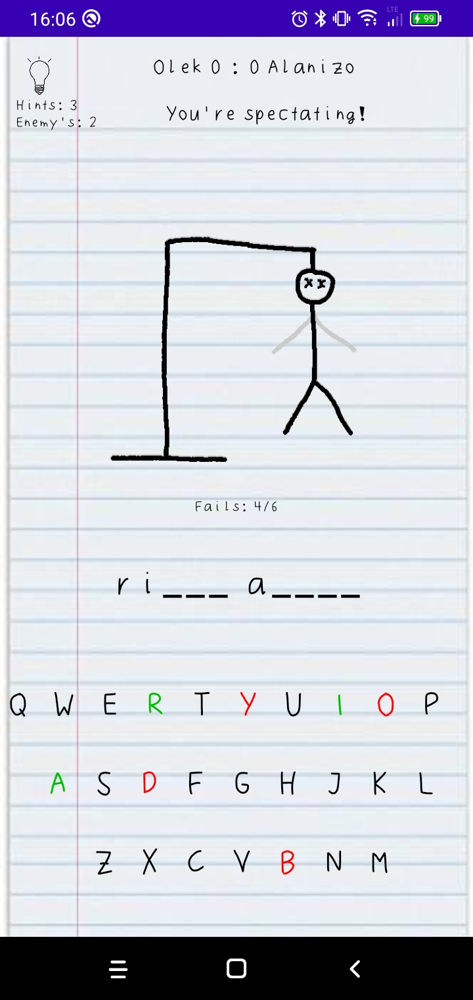
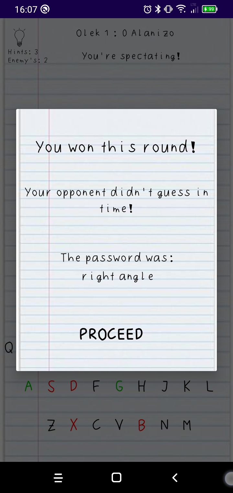
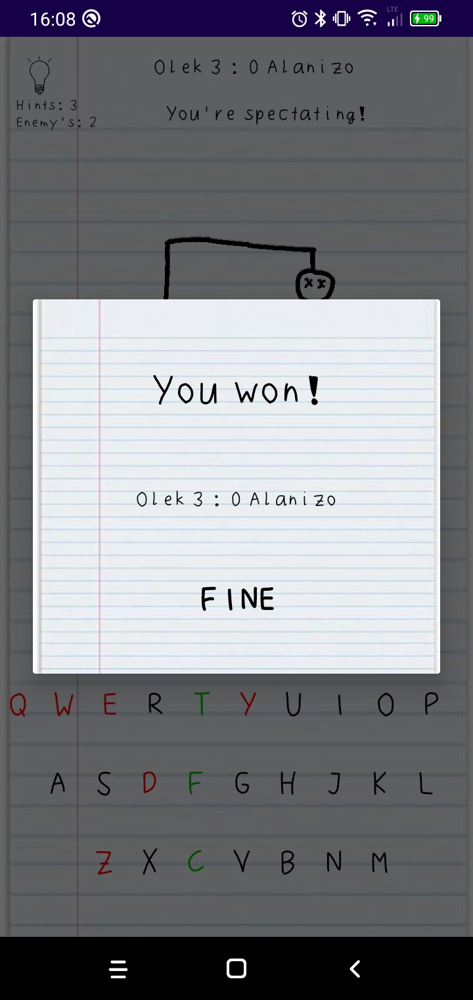

## Hangman

Hangman is a mobile game developed by me (Aleksander Katan) for Mobile Programming course at TCS Jagiellonian University.

The app lets two players play the famous Hangman game via Bluetooth. One player chooses a password, the other tries to guess it. Then the roles swap. The game lasts until either of the players gathers enough victory points.

The app can be easily installed by downloading app-release.apk file located in app/release folder and then running it on your device.

  
  

